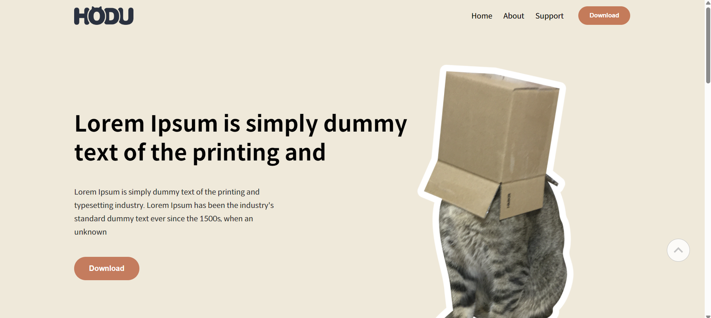
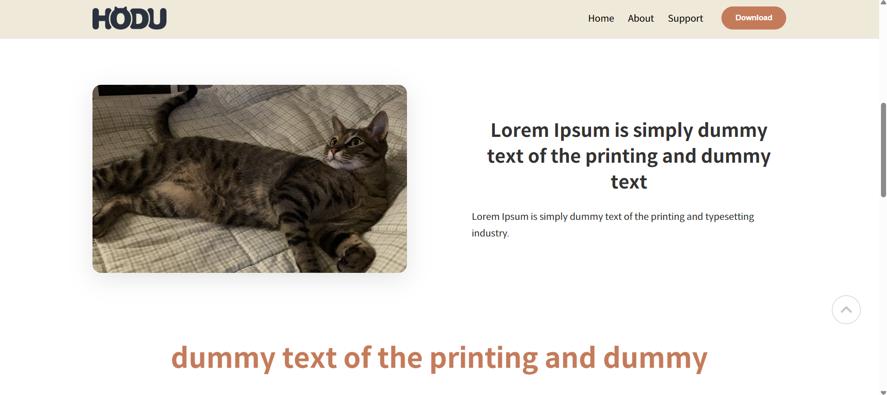
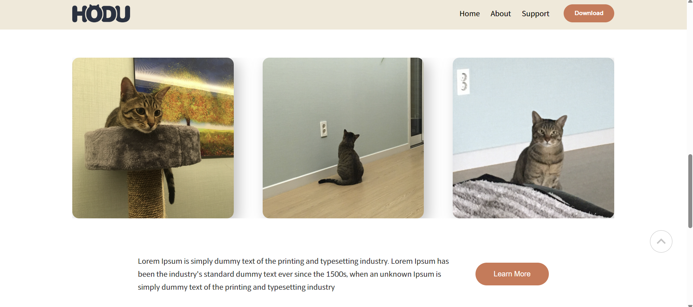
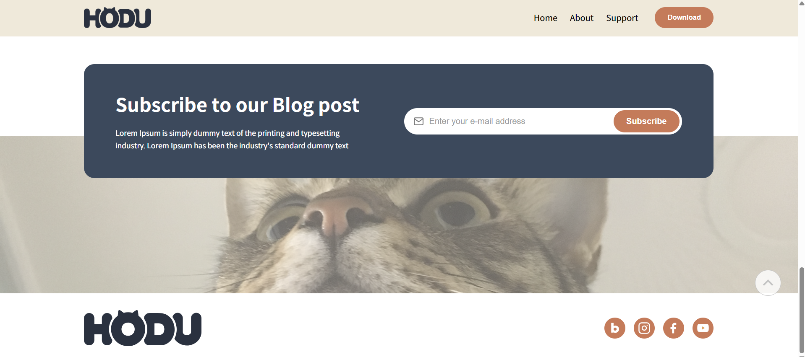

# landingPage

가상의 고양이 브랜드 **HODU**를 소개하기 위한 반응형 랜딩페이지입니다.
HTML과 CSS만을 사용하여 시맨틱 구조, 반응형 레이아웃, 접근성을 고려해 구현했습니다.

* GitHub Pages 배포 ([랜딩페이지](https://dongmyeongback.github.io/landingPage/))
* Desktop / Tablet / Mobile 전 해상도 대응

## 미리보기

| Desktop | Mobile |
|--------|--------|
|  |  |
|  |  |
|  |  |
|  |  |

---

## 프로젝트 개요

* **프로젝트 목적**
  정적인 랜딩페이지 구현을 통해 HTML 시맨틱 구조와 CSS 레이아웃(Flex, Grid), 반응형 웹 디자인에 대한 이해를 높이기위해 실시한 프로젝트입니다.

  다음 항목에 대해 집중하여 프로젝트를 실시했습니다.
  * 구조에 따라 적절한 HTML 시멘틱 태그 사용
  * Flexbox와 Grid를 활용한 레이아웃
  * Media Query를 활용한 반응형 웹 구현

---

## 사용 기술

* **HTML**

  * 시맨틱 태그(`header`, `main`, `section`, `footer`, `nav`, `figure`)
  * 접근성을 고려한 `aria-label`, `alt`, `sr-only` 속성 사용

* **CSS**

  * Flexbox / Grid 기반 레이아웃
  * CSS 변수(`:root`)를 활용한 컬러 관리
  * Media Query를 이용한 반응형 디자인
  * 버튼 Hover 인터랙션 구현

---

## 폴더 구조

```
├── index.html
├── styles/
│   ├── reset.css
│   └── style.css
├── images/
│   ├── logo.png
│   ├── box-cat.png
│   ├── blanket-cat.jpg
│   └── ...
```

---

## 주요 기능

### 1. 헤더(Header)

* Sticky 적용
* 데스크톱 / 모바일 환경에 따라 상이한 네비게이션

### 2. 히어로 섹션(Hero)

* 화면 너비에 따라 이미지와 텍스트의 시각적 균형 고려
* Flex 레이아웃을 활용해 화면 너비에 따라 이미지와 글의 정렬 방향을 조절

### 3. Feature-01 섹션

* 이미지 비율 유지를 위한 padding-top 기법 적용 

### 4. Feature-02 섹션

* Grid 레이아웃을 활용한 이미지 카드 구성
* `overflow = hidden;` 을 통해 모바일 화면에서 자연스럽게 잘리도록 설정

### 5. 구독 섹션(Subscribe)

* 이메일 입력 폼 UI 구현
* 데스크탑 환경에서 `position=absolut`를 활용해 input과 button이 겹쳐보이도록 구현 

### 6. 푸터(Footer)

* 소셜 미디어 아이콘 영역
* 모바일 환경에서 footer-nav를 노출

### 7. 추가 UI 요소

* 스크롤 탑 버튼 (svg 활용)
* 구독 완료 시 노출되는 모달 UI

---

## 반응형 대응

* **1200px 이상**: 데스크톱 레이아웃
* **768px ~ 1024px**: 태블릿 레이아웃
* **480px 이하**: 모바일 레이아웃

  * rem을 활용하여 너비에 따라 이미지 등의 크기가 조절에 용이
  * 네비게이션 축소 및 모바일 메뉴 사용
  * 버튼 및 폰트 크기 조정

---

## 접근성 고려 사항

* 스크린 리더용 `sr-only` 제목 제공
* 모든 이미지에 `alt` 텍스트 적용
* 버튼 및 내비게이션에 `aria-label` 사용

---

## 배운 점

* 시맨틱 HTML 구조의 중요성
* Flex와 Grid를 조합한 레이아웃 설계
* Media Query를 활용한 단계적 반응형 처리
* UI 컴포넌트 단위 CSS 관리의 필요성

---

## 개선 및 확장 아이디어

* JavaScript를 활용한 실제 모달/메뉴 인터랙션 구현
* 이메일 구독 폼 유효성 검사 추가
* CSS 변수 기반 다크 모드 지원

---

## 제작자

* 이름: 백동명
* 학습 목적의 개인 프로젝트

## 개발 기간

* 개발 기간: 25.12.12 ~ 25.12.19

---

> 본 프로젝트는 HTML/CSS 학습을 목적으로 제작되었습니다.
